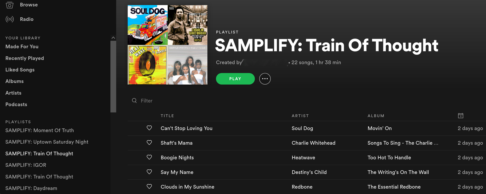

# SAMPLIFY: Get Samples from any Playlist / Album / Song / Search

## Getting Started
Setup TLDR; 
```
git clone https://github.com/qzdl/samplify.git && cd samplify && venv samplify && source samplify/bin/activate && pip -r requirements.txt
```

- Ensure you are running python3 with venv
- Clone this repo with `git clone https://github.com/qzdl/samplify.git`
- `cd` to the new directory, and create a new virtual environment with `venv samplify`
- Run `source samplify/bin/activate` to activate the new environment.
- Install the dependencies with `pip -r requirements.txt`
  * Refer to [`requirements.txt`](./requirements.txt) for a list of packages

### Spotify API Access; config.py
If you haven't used the spotify API before:
- Head to the [developer dashboard](https://developer.spotify.com/dashboard/) and register a new application
- Setup a redirect as `http://localhost:<SOME_FREE_PORT>`
  * This can be found in the information page of a registered application > edit settings.
- Create `config.py` at the root of the repository, and populate it as follows:
(NOTE: these are not valid credentials )
```
# ClientID from registered application at:
https://developers.spotify.com/dashboard/applications
client = '7bf224e8jn954215s3g11degh599e3an'

# Client Secret can be found below 'SHOW CLIENT SECRET' once you are on the info
# page of a registered application
secret = '7bf224e8jn954215s3g11degh599e3an'

# The easiest way I've found to get this is to hit the /v1/me endpoint:
# https://developer.spotify.com/console/get-current-user/
# find the "uri" property, e.g. "uri": "spotify:user:1134745600"
username = '1134745600'

# setup this redirect on a registered application. make sure it
# is identical to the letter or you'll get "INVALID REDIRECT"
redirect = 'http://localhost:8889'
```

## Usage


## Documentation
### Command Line Interface `CLI`
Detail about the CLI can be found by reading the documentation provided by the `--help`
option flag. Documentation will but updated there as the project progresses.
```
(samplify) [samuel@qzdl spotify-samples]$ python samplify.py
usage: samplify.py [-h] (-l LINK | -s SEARCH)
                   (--album | --playlist | --song | --current-song)
                   [--direction DIRECTION] [--output-name OUTPUT_NAME]
                   [--output-type OUTPUT_TYPE] [--username USERNAME]
samplify.py: error: one of the arguments -l/--link -s/--search is required
```

```
(samplify) [samuel@qzdl spotify-samples]$ python samplify.py --help
usage: samplify.py [-h] (-l LINK | -s SEARCH)
                   (--album | --playlist | --song | --current-song)
                   [--direction DIRECTION] [--output-name OUTPUT_NAME]
                   [--output-type OUTPUT_TYPE] [--username USERNAME]

optional arguments:
  -h, --help            show this help message and exit
  -l LINK, --link LINK  Click "Share" > "Copy Link"
  -s SEARCH, --search SEARCH
                        Search as you would in the app
  --album
  --playlist
  --song
  --current-song
  --direction DIRECTION
  --output-name OUTPUT_NAME
  --output-type OUTPUT_TYPE
  --username USERNAME
```
### Example Output (from stout)
```
(samplify) [samuel@qzdl spotify-samples]$ python samplify.py --search 'uptown saturday night camp lo' --album
# SAMPLIFY: Uptown Saturday Night

This playlist was generated using Samplify.
GitHub: https://github.com/qzdl/samplify

The album, Uptown Saturday Night, has been broken down into:
"contains samples of "

Percentage Matched: 81.8%

Songs with no match:
Black Connection -> Love Is the Answer, by Van McCoy and The Soul City Symphony
Sparkle - Mr. Midnight Mix -> Leyte (Live at the Funky Quarters), by Cal Tjader

==> search terms:
Love Is the Answer van mccoy soul city symphony
Leyte (Live at the Funky Quarters) cal tjader

Sample Info:
Luchini AKA This Is It -> Adventures in the Land of Music, by Dynasty
Park Joint -> September 13, by Deodato
Sparkle -> Leyte, by Cal Tjader
Rockin' It AKA Spanish Harlem -> A Little Spice, by Loose Ends
Rockin' It AKA Spanish Harlem -> Rockin' It, by The Fearless Four
Rockin' It AKA Spanish Harlem -> The Bridge, by MC Shan
Black Nostaljack AKA Come On -> Tripping Out, by Curtis Mayfield
Coolie High -> Funny How Time Flies (When You're Having Fun), by Janet Jackson
Coolie High -> It's a New Day, by Skull Snaps

==> search terms:
Adventures in the Land of Music dynasty
September 13 deodato
Leyte cal tjader
A Little Spice loose ends
Rockin' It the fearless four
The Bridge mc shan
Tripping Out curtis mayfield
Funny How Time Flies (When You're Having Fun) janet jackson
It's a New Day skull snaps

Created playlist SAMPLIFY: Uptown Saturday Night
```


## Program Overview
Playlists are read from Spotify through the Spotify API using Spotipy.  
Song names and artists are stored and then located on `Whosampled.com`.  

A request is sent to the site searching for the song name, selecting a result  
with the matching artist name and storing the link to that song's page. A second  
request is sent to that song page, and BeautifulSoup is used to scrape HTML for  
sample names, which are also stored.

Next, the samples are located using Spotipy, if they exist. Finally, a new  
playlist is created for the user, containing all the samples available on Spotify.

## Example Route Parsing
Discovering how payloads differ to extend the functionality to albums, current song,  
etc, is a process that requires some exploration. I'm sure there's examples of that  
in the commit history.
```python
album = None
with open('test_payload_f.json', 'r') as f:
    import json
    album = json.loads(f.read())

album_ttle = album['name']
artist = album['artists'][0]['name']
tracks = album['tracks']['items']

track_info = []
for track in tracks:
    info = {}
    info['title'] = track['name']
    info['uri'] = track['uri']
    track_info.append(info)

print(json.dumps(track_info, indent=2))
```

## Notes
This project is based on the work of [Christopher Pease (cpease00)](https://github.com/cpease00/)'s sample collection tool   [Spotify-Samples](https://github.com/cpease00/).
Without his [medium article](https://medium.com/@chris.m.pease/automating-finding-music-samples-on-spotify-with-whosampled-54f86bcda1ee) on the topic,   
I would have had a bunch more pain to go through in producing the project as it is now.

### `Options()`
### `Samplify()`
### `Scraper()`
